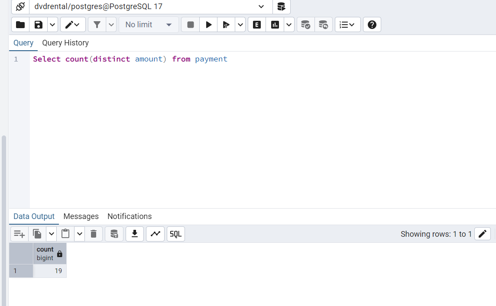

# Markdown
Hi, I am sharing how to use markdown notes here  


# Heading  
## Sub heading  
Text is **bold**  
Text is __bold__  
Text is *italics*  
Text is _italics_  
Text is ***bold & italics***  
Text is ___bold & italics___  
Text is __*bold & italics*__  
X<sup>2  
H<sub>2</sub>O  
<mark>highlight</mark>  
Text is ~~crossed off~~  
`Text is code`
```
Select * from payment   : we can write any code in between  
   where amount > 100;
```  

[This is a link](https://www.google.com/)  
<https://www.google.com/>  : This is also a link  
https://www.google.com/  : This is also a link 

  

>  hello there  
>  how are you  
>>  I am satyendra   : In this was we can write block quotes.  

Hello there 

---

I am Satyendra  

Hello there    

***  

I am satyendra  

Hello there  
___  

I am satyendra          : All this is used to add lines in between 


1. Item 1      
2. Item 2  
3. Item 3  
1. Item 4  

* Item 1  
* Item 2  
* Item 3  


- Item 1
- Item 2  
- Item 3  


+ Item 1  
+ Item 2  
+ Item 3  
    + Item 4  
        * Item 5  
        * Item 6  
            1. Item 7     : use tab key to nest  
    + Item 8  


|  Col 1  |  Col 2  |
|---------|--------:|
| This    |  is     |
| is      |  a      |
| a       |  good   |
| table   |  one    |  

: Putting : towards right end will right align the col 2

|  Col 1  |  Col 2  |
|---------|:--------|
| This    |  is     |
| is      |  a      |
| a       |  good   |
| table   |  one    |  

: Putting : towards left end will left align the col 2

|  Col 1  |  Col 2  |
|---------|---------|
| This    |  is     |
| is      |  a      |
| a       |  good   |
| table   |  one    |


|  Col 1  |  Col 2  |
|---------|:-------:|
| This    |  is     |
| is      |  a      |
| a       |  good   |
| table   |  one    |  

: Putting : in both ends will center align the col 2  
